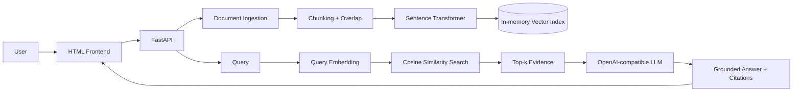

# 01 — Vanilla RAG

A production-oriented Retrieval-Augmented Generation (RAG) baseline: document ingestion → chunking → sentence embeddings → cosine vector search → grounded LLM generation with citations.

## Overview

This project intentionally implements the RAG pipeline without LangChain, LlamaIndex, or a managed vector database. The goal is to make every core retrieval step explicit and inspectable.

## Problem

LLMs can answer confidently without using the user's documents. This service retrieves relevant document chunks first and gives those chunks to the LLM as evidence.

## Real-World Use Case

A small internal knowledge assistant for engineering notes, product documentation, policies, or research material stored as UTF-8 TXT/Markdown files.

## Architecture



## Features

- TXT/Markdown ingestion
- Overlapping chunking
- `all-MiniLM-L6-v2` sentence embeddings by default
- NumPy cosine-similarity vector search
- Top-k retrieval
- OpenAI-compatible LLM provider abstraction
- Source/chunk citations returned with every answer
- FastAPI + automatic OpenAPI docs
- Input validation and clear HTTP errors
- Docker and Docker Compose
- GitHub Actions CI
- Unit/API tests

## Tech Stack

Python 3.11, FastAPI, Pydantic, Sentence Transformers, NumPy, OpenAI-compatible APIs, pytest, Docker, GitHub Actions.

## Project Structure

```text
01-vanilla-rag/
├── app/main.py
├── frontend/index.html
├── tests/test_core.py
├── .github/workflows/ci.yml
├── .env.example
├── Dockerfile
├── docker-compose.yml
├── requirements.txt
└── README.md
```

## Installation

```bash
python -m venv .venv
# Windows PowerShell
.\\.venv\\Scripts\\Activate.ps1
pip install -r requirements.txt
```

## Environment Variables

Copy `.env.example` to `.env` and configure an OpenAI-compatible endpoint:

```text
LLM_API_KEY=your-key
LLM_BASE_URL=https://api.openai.com/v1
LLM_MODEL=gpt-4o-mini
EMBEDDING_MODEL=sentence-transformers/all-MiniLM-L6-v2
```

Never commit `.env` or credentials.

## Running Locally

```bash
uvicorn app.main:app --reload
```

Open `http://127.0.0.1:8000` for the UI or `http://127.0.0.1:8000/docs` for Swagger.

## API Documentation

- `GET /health` — service health
- `POST /api/documents` — multipart upload of `.txt` or `.md`
- `POST /api/query` — retrieve evidence and generate a grounded answer

Example query:

```json
{"question":"What does the document say about deployment?","top_k":4}
```

## Evaluation

Automated tests cover chunk boundaries, source preservation, vector retrieval relevance, and API health. No model-quality benchmark is claimed yet.

## Performance

Not benchmarked yet.

## Docker

```bash
cp .env.example .env
# edit .env
docker compose up --build
```

## Deployment

Not deployed yet. A public URL must only be added after a real deployment has been completed and verified.

## Live Demo

**Not available yet.** This is intentionally not fabricated.

## Screenshots

Not captured yet.

## Future Improvements

- PDF ingestion with page-aware citations
- Persistent vector storage
- BM25/hybrid retrieval
- Reranking
- Retrieval evaluation dataset
- Authentication and multi-user isolation
- Streaming generation

## License

MIT
